# My Artist Portfolio

Hello! I go by AncientStraits on the internet, but I realized I do not have an art portfolio!
So I'm gonna put some stuff here...

## Newer Sketches (Made in 2026, very recent!)

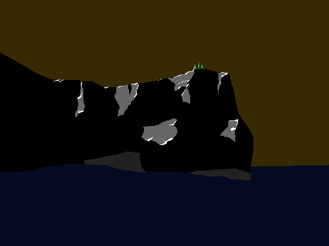
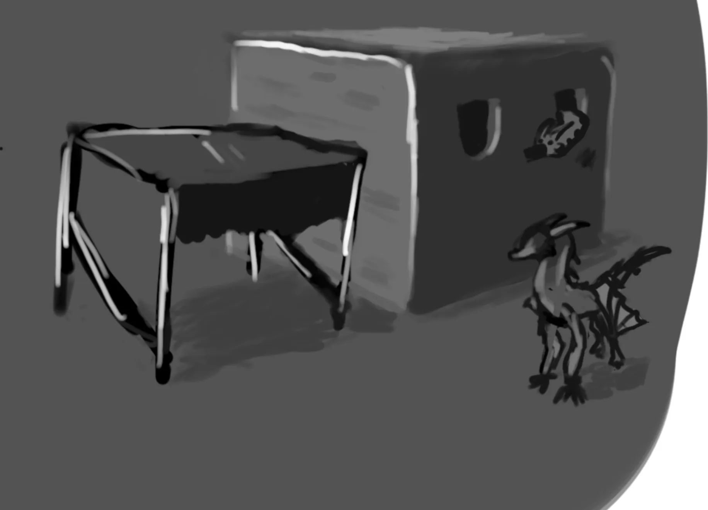
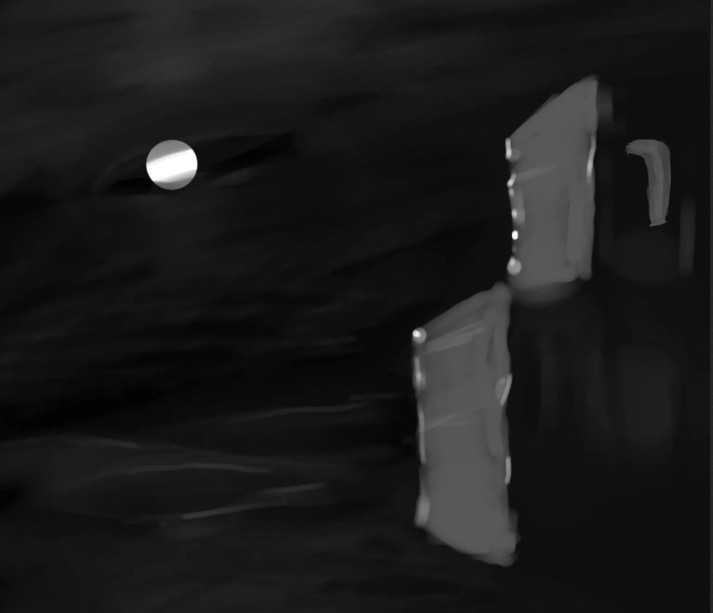
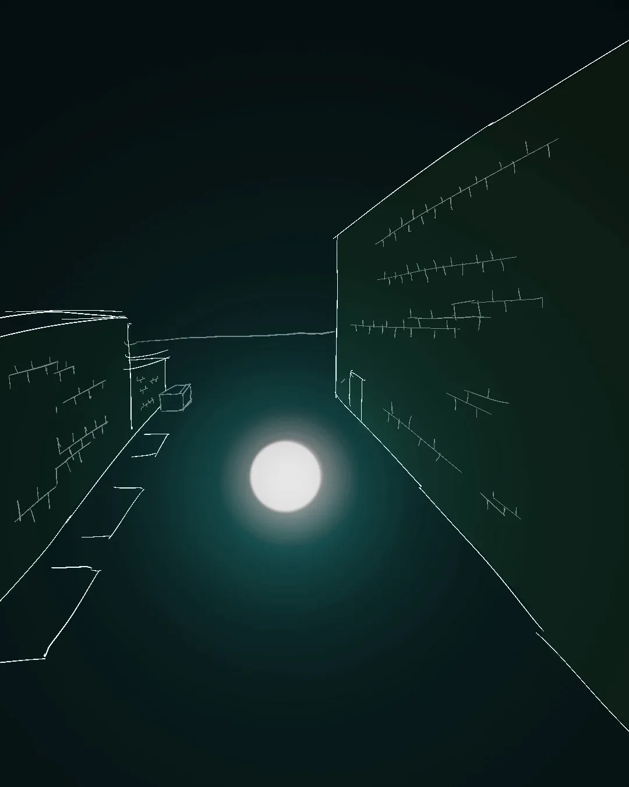
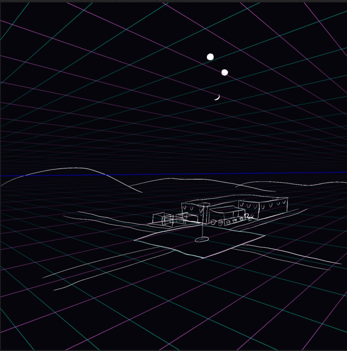

## Concept Art for a Game (2026)

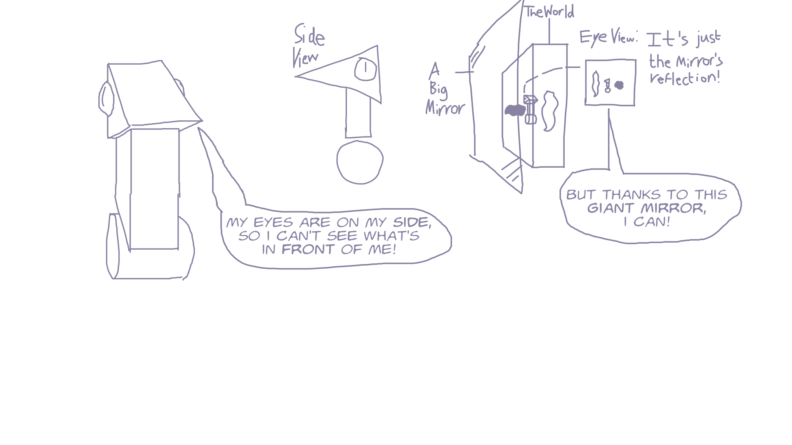

<!-- ## I love wings of fire

I got into this fandom around 2020. I haven't read a book since I finished Book 13 in 2020,
but I have ALWAYS wanted to animate dragons since I read this.
My lifetime goal has been to animate the prologue of Book 1.

But, for some reason, I have been ashamed of drawing dragons, especially in public.
It feels like when I latch onto and obsess over something, I never want anyone to know I like it.
That's probably why I've drawn way less dragons than I want to. -->

## Procreate Sketches (2025-2026)

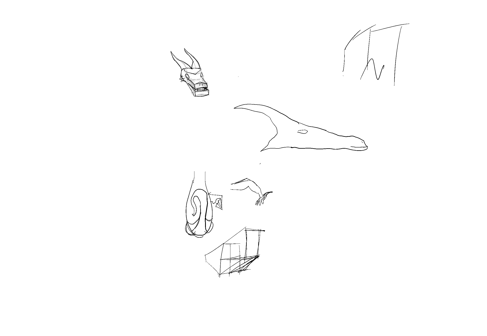
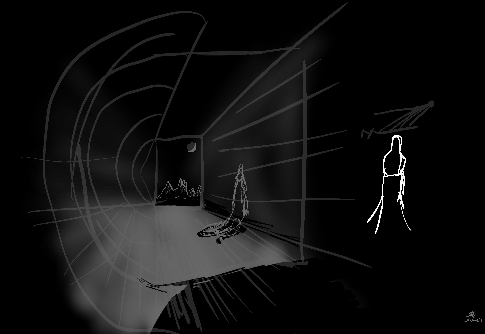
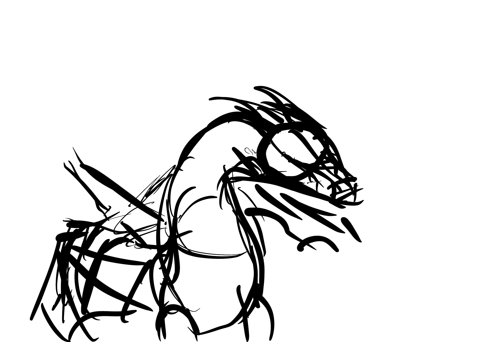
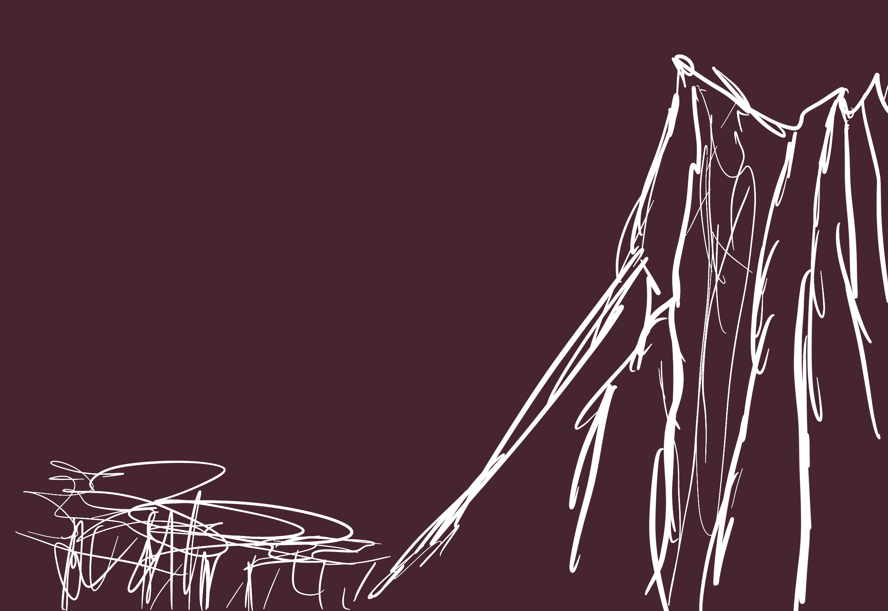

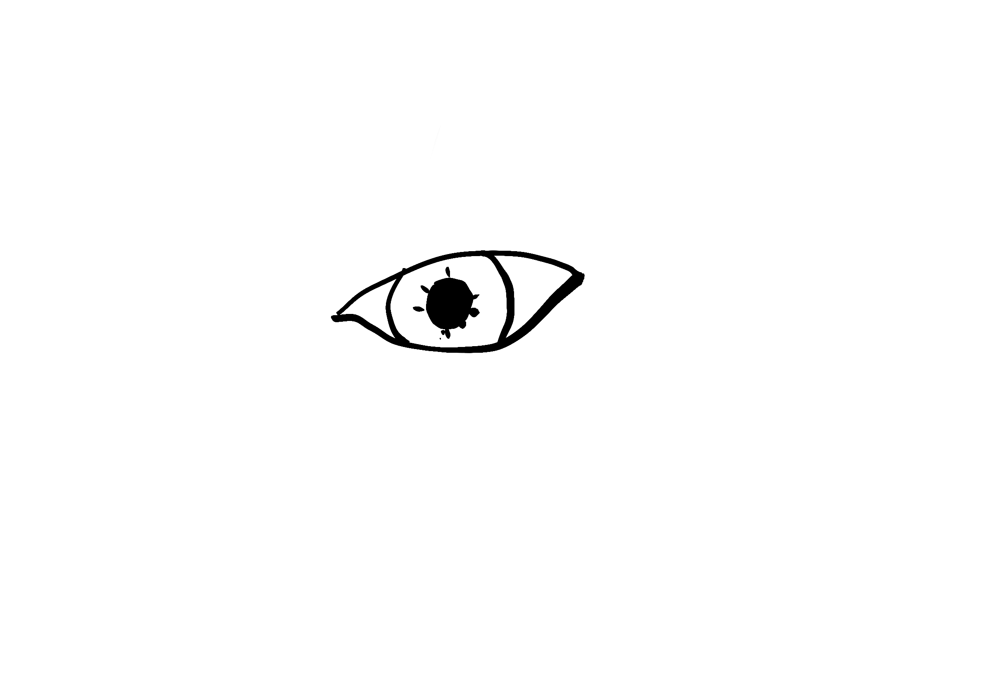
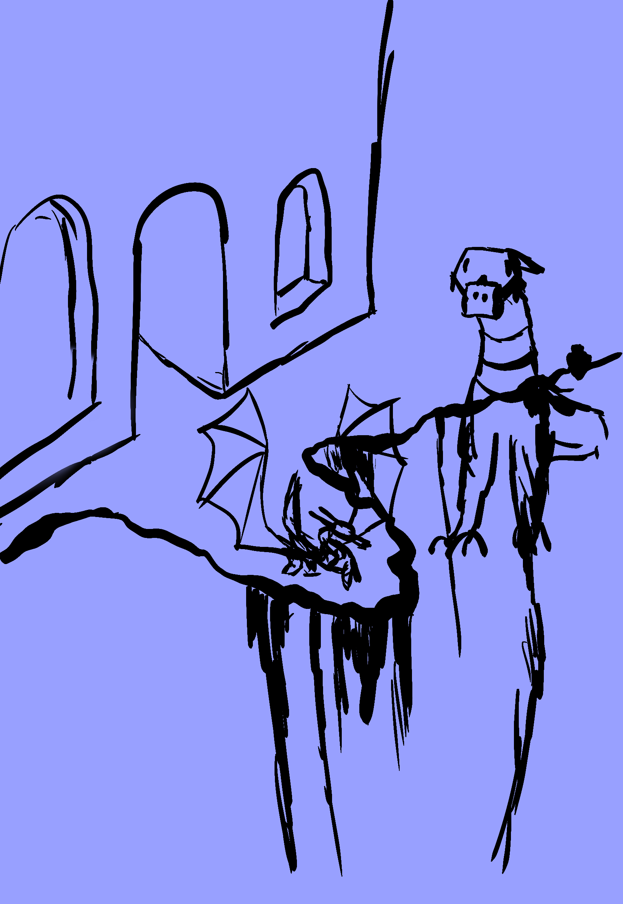
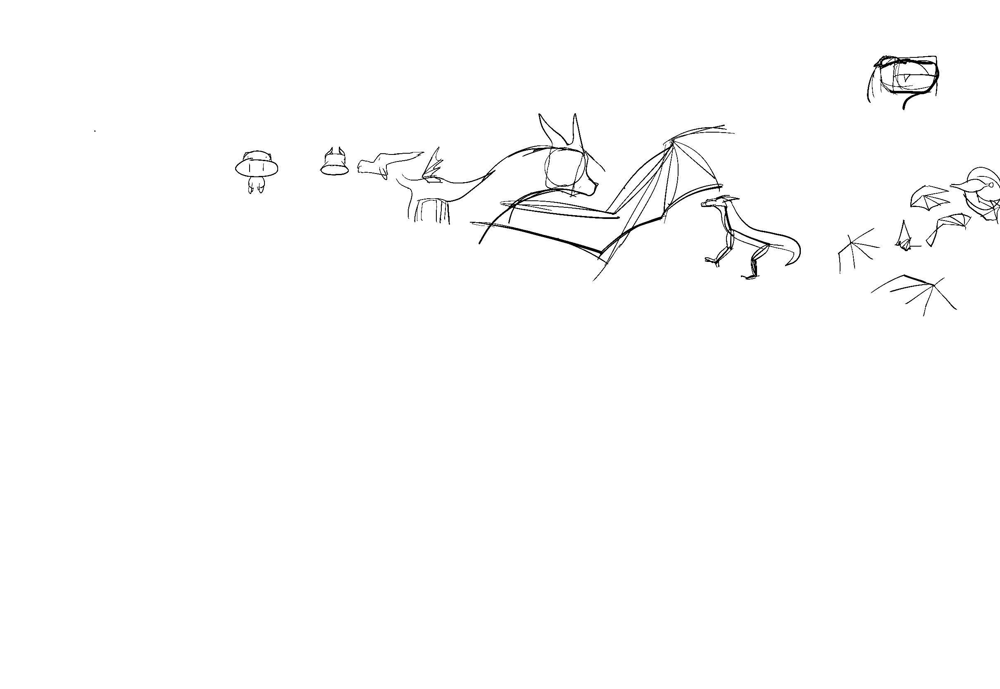

## A Dragon Flying (2024)

<video width="100%" controls>
    <source src="res/dragon_flying.mp4" type="video/mp4" />
    video.
</video>

I think I finished this on October 16, 2024.
I was very proud of it.

## The Dragon Painting (2024)

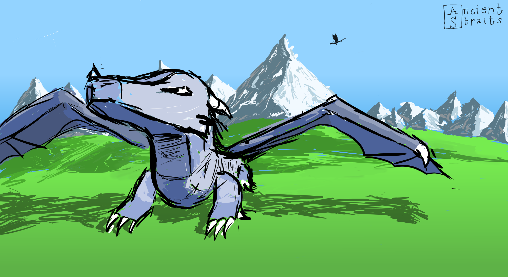

I made this on September 7, 2024 (wow, that was long ago).
It is probably one of my best artworks, and one of my ONLY paintings.
It is the only color painting I have made that has a dragon in it.

## A Dragon Sketch (2024)

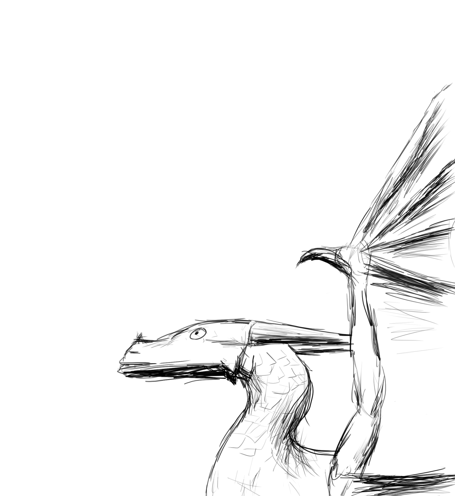

A random sketch I made on July 16, 2024.
